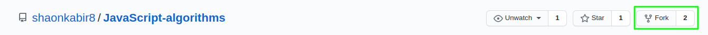
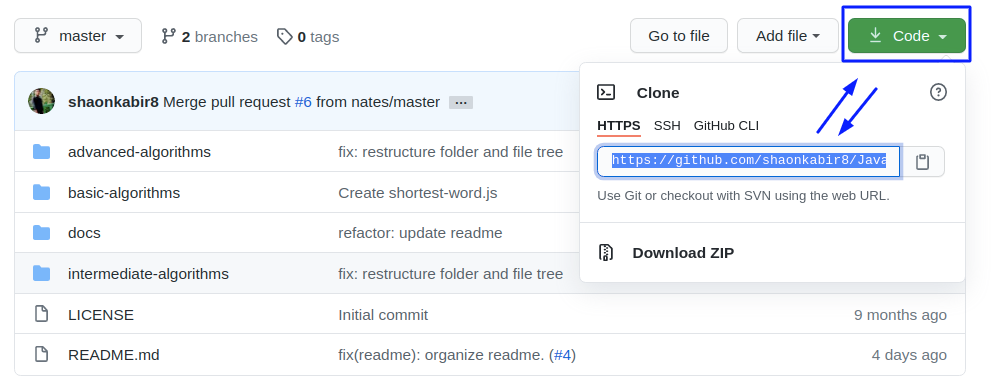
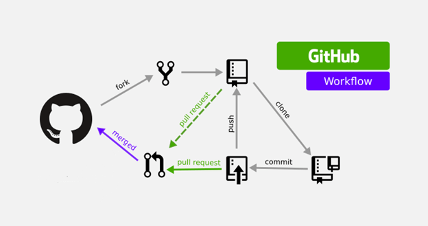

# 🚀 Contribution to JavaScript Algorithms

You're reading this docs means you're interseted to contribute. Thanks. We appreciate it :+1:


## Contribution Steps:

We've alredy sepharated our folder and file structure to make entire contribution process much more easier :boom: 

**If you wish to change some major changes, feel free to open an [issue](https://github.com/shaonkabir8/JavaScript-algorithms/issues) first. we highly appreciate it. :+1:**

**:rocket: follow the steps below to start contributing**

1. Fork the repo

2. Clone your forked copy

3. `Navigate` to your forked copy → open your most favourite `editor` and start Hacking. :rocket: 
```bash
➜  ~  cd JavaScript-Algorithms/
```
4. Make sure to maintain a  **Human readable** commit message style like [semantic commit](https://gist.github.com/joshbuchea/6f47e86d2510bce28f8e7f42ae84c716), [Conventional commit](https://www.conventionalcommits.org/en/v1.0.0-beta.4/) or the better way you like most. :nerd_face:
 
- :heavy_check_mark: Use the imperative present tense: `"add/fix/change"`, not `"added/fixed/changed"` nor `"adds/fixes/changes".`

5. Once you write your code, Push it to your forked copy and make a **pull request**. Because, we use the [fork-and-branch git workflow](https://blog.scottlowe.org/2015/01/27/using-fork-branch-git-workflow/). It's kinda easy. :sunglasses:

**Are you still confussed to how it's working?**\
Don't worry. Let's try to understand once again. :boom:



**So, What are you waiting for? Let's start hacking. :rocket:**

#### Feel free to give a Star on our repo. we appreciate it. :+1: